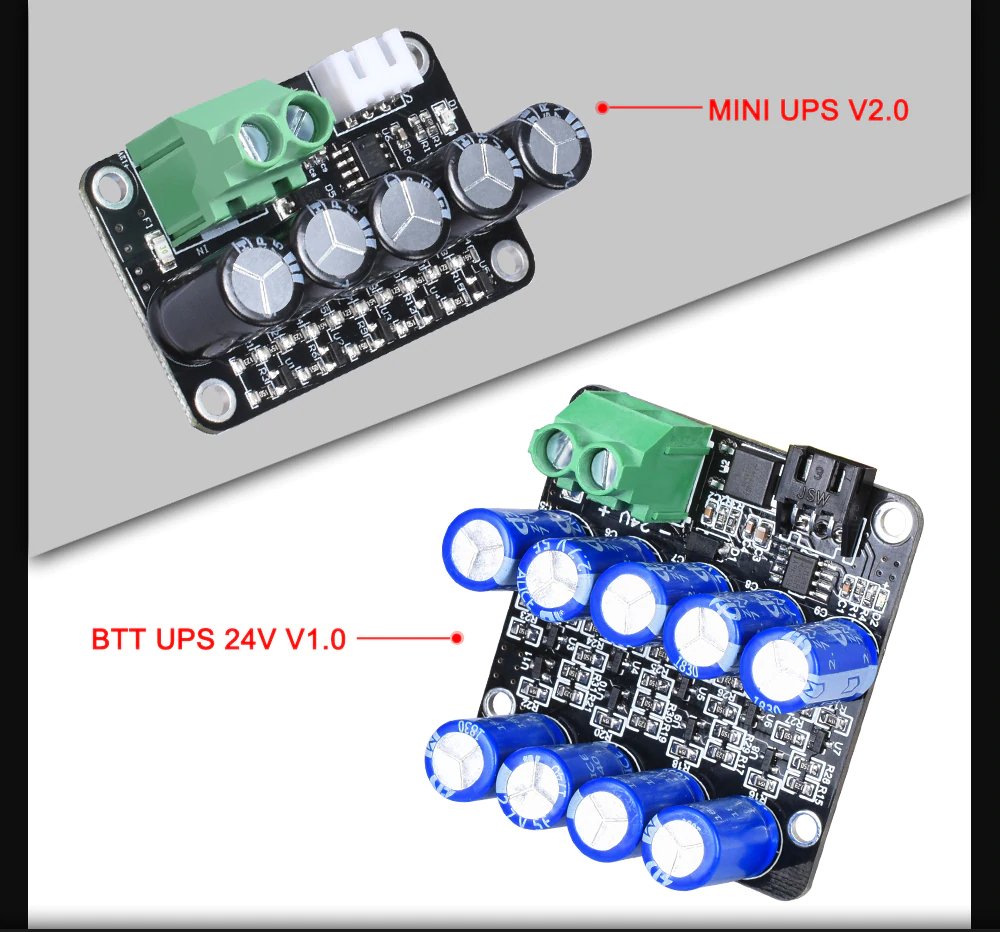

# BIGTREETECH-MINI-UPS-V2.0
Компания BigTree Technology Co., Ltd. разработала этот модуль сбоя питания для обнаружения сбоя питания во время печати и обеспечения возможности возобновления печати после восстановления питания.

BTT UPS 24V V1.0 - это внешний модуль 3D-принтера с функцией возобновления печати при выключенном питании, который был создан командой 3D-печати из Shenzhen Big Tree Technology CO., LTD. Это применимо ко всем 3D-принтерам с питанием от источника постоянного тока 24 В, таким как принтер Ender 3.

## Особенность：
- Добавлена микросхема компаратора напряжения LM393, которая может точно обнаруживать сбой питания;
- Оснащен 9 суперконденсаторами 2,7V 5F для хранения электроэнергии, поэтому после обнаружения сбоя питания принтер может успешно завершить соответствующую операцию.
- В интерфейс питания добавлена схема защиты от обратного подключения для предотвращения необратимых повреждений, вызванных обратным источником питания, что значительно защищает печатную плату;
- Модуль небольшой и простой в установке;
- Основная функция: реализовать функцию возобновления печати при отключении питания;
